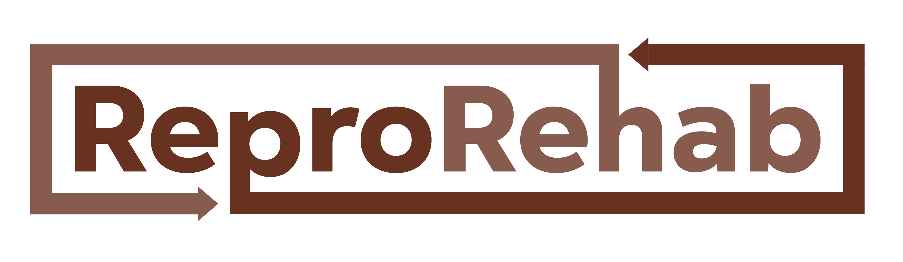

 
# ReproRehab POD-3 (2024-25)
*TAs: Andrew Hooyman and Rini Varghese* 
Learn more about ReproRehab here: https://www.reprorehab.usc.edu

# Overview  
Welcome Pod 3! We have created a GitHub repository as a centralized location to store and share all the materials/code/resources discussed during the bootcamp. 
Each week, we will share with you a **"codebook"** that contains the code and description for what we covered in class. This codebook will be shared in 3 formats to ensure it is accessible to everyone:
1) ***.IPYNB format***: in Jupyter Notebook format. This will contain the most comprehensive format with commented code and markdown descriptions of what each line does. It also is executable! (more on this later)
2) ***.PDF format***: in plain old PDF format. This will be just as comprehensive but not executable. 
3) ***.R format***: in native R format. This will only have a commented version of the code, but essentially will run on your R studio interface and do all the exact same things.

To follow along in each class, go to this [folder](https://github.com/rinivarg/ReproRehab2024-Pod3/tree/main/Git%20and%20GitHub) and learn how you can integrate this repository with R.

# Curriculum
Below is the curriculum which shows the week-wise breakdown of the topics we will cover. Everything on here is subject to change as the needs of the pod evolve. Looking forward to 8 weeks of learning and teamwork!

  
Click to expand

  
## [Week 1](https://github.com/rinivarg/ReproRehab2024-Pod3/tree/main/Materials/Week%201): Tutorial on R/Rstudio and “Cheatsheets”
This lesson is focused on orienting learners to [R](https://cran.r-project.org) and [RStudio](https://posit.co/downloads/). We will go over how to use the many default libraries in R and how to install popular packages for us all within RStudio Learners have different goals and sometimes it is difficult to link how R can help a learner achieve that goal. To this end, we will connect learners with all the available [“Cheatsheets”](https://posit.co/resources/cheatsheets/) that can provide an overview of most of R’s functionality, from data manipulation to data visualization to deep learning.

## [Week 2](https://github.com/rinivarg/ReproRehab2024-Pod3/tree/main/Materials/Week%202): Importing Data into R
The first step to using R for research is to import one’s data in R’s memory. There are good base functions to import basic file types such as .csv files, but many times the format and file type of the data we wish to import can vary in a way base functions in R do not support. We will go over how to import data of different files types, including: SPSS files, SAS files, Excel spreadsheets, and even using library APIs to import data from REDCap databases and Google sheets. 

## [Week 3](https://github.com/rinivarg/ReproRehab2024-Pod3/tree/main/Materials/Week%203): Data Cleaning and Manipulation
Once data is loaded into R it rarely is in the structure or format that is ready for analysis. In this lesson we will provide the best practices for handling missing data, converting data into different variable types, and converting data from wide to long and from long to wide formats.

## [Week 4](https://github.com/rinivarg/ReproRehab2024-Pod3/tree/main/Materials/Week%204): Summarizing and Visualizing Data
A good sanity check before plugging in your now clean and formatted data into a statistical model is to visualize it. This is good for a priori check of outliers, normality, and overall trends you may or may not expect. We will also present methods for compiling data into modifiable demographic tables that are publication ready.

## [Week 5](https://github.com/rinivarg/ReproRehab2024-Pod3/tree/main/Materials/Week%205): Statistical Analysis
Now that you have imported, cleaned, manipulated, and visually checked your data you are ready to confidentally analyze it. In this lesson we will present how to use base functions in R to run general and generalize linear models for statistical analysis. Additionally, we will go over how to use a library specific for mixed effects models for repeated measures designs and the incorporation of random effects.

## [Week 6](https://github.com/rinivarg/ReproRehab2024-Pod3/tree/main/Materials/Week%206): Codebooks and Cloud Computing
You now have the makings of a working analytical pipeline that fits your data and your research question. One day you will want to share it with the world! In this lesson we will present different methods for sharing your code either a vignette or notebook that makes your work accessible to a variety of audiences.

## [Week 7 & 8](https://github.com/rinivarg/ReproRehab2024-Pod3/tree/main/Materials/Week%207%20%26%208): Personalized Lessons!!
We have now covered the basics on all things R that are necessary for reproducible research in rehabilitation science. Now it is your turn to tell us what you would like to learn next! Don’t be afraid to think big or aim for a deep dive into one specific area! Even if it is something that we are unfamiliar with, will make sure to connect you with someone in the ReproRehab cohort that can help!

## [Bonus Content](https://github.com/rinivarg/ReproRehab2024-Pod3/tree/main/Git%20and%20GitHub): Intro to Git & GitHub
You've probably heard by now about GitHub for sharing your code and data, but it's much more than that! In fact, Git (the software that the GitHub platform uses) is first and foremost a version-control tool. Through that very function, it allows you to travel in time on some version of your own code *and* collaborate with others on the same code without needing to have a million versions (e.g., code_FINAL_RV, code_FINAL_RV_AH, code_FINALFINAL_AH_RV_RV2024... lol, you get the gist).   To learn more, visit the [content folder](https://github.com/rinivarg/ReproRehab2024-Pod3/tree/main/Git%20and%20GitHub).

****

 
